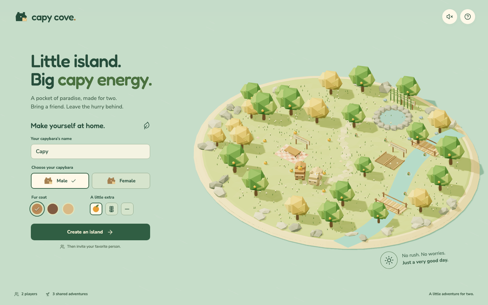

# Capy Cove

A little island. A friend. A very good day.

A two-player, low-poly 3D browser adventure built with TypeScript, Three.js, Vite, and PeerJS. All scenery and capybaras are procedural 3D models; fonts ship locally. No account, game-server deployment, or paid asset pack is required.

**[Play Capy Cove](https://astoyanov2231.github.io/capy-cove/)**



## Take a friend to the island

1. Choose a name, male/female capybara, fur coat, and orange/flower/no accessory. These choices are cosmetic; both capybaras have the same abilities.
2. Create an island and copy the private invite link.
3. Your friend opens the link and chooses their capybara.
4. Both tap **I’m ready to explore**. You spawn beside each other.
5. Follow the glowing items and the dark diamond on the map. Each player must collect at least one item per quest. Gather the shared total, meet at the destination, and both interact.

### Three shared adventures

- **A picnic for two:** gather six oranges and set the picnic. Your fruit basket appears on the table.
- **A little room to bloom:** gather four seed pouches and plant the riverside garden. The beds fill with flowers.
- **The art of doing nothing:** gather four smooth stones and warm up Pebble Hot Spring. Steam rises, the adventure completes, and you can keep wandering together.

Explore bridges, an orange grove, bamboo, wildflowers, butterflies, and a winding swimmable river. Send a heart whenever words are unnecessary.

### Controls

| Action | Desktop | Touch |
| --- | --- | --- |
| Move | WASD or arrow keys | Direction pad |
| Collect / help | E or Space | Context action button |
| Send a heart | H | Heart button |
| Zoom | Mouse wheel | Default camera framing |
| Journal | Click current quest heading | Tap current quest heading |
| Sound / help / leave | Top-right buttons | Top-right buttons |

Movement is camera-relative. Swimming is automatic and slower than walking. Sound is optional and starts only after you enable it. Reduced-motion settings disable ambient animation; gameplay remains animated.

## Run locally

Requires **Node.js 22.12+** (or 24+) and npm.

```sh
npm ci
npm run dev
```

Open the Vite URL. Normal development uses the public PeerJS signaling service, just like the deployed game. The host's invite must use an address the guest can reach; `localhost` links only work on the same computer. For another device on your LAN use the host's LAN IP and port.

```sh
npm run check       # ESLint, unit tests, type check, production build
npx playwright install chromium
npm run test:e2e    # Isolated local signaling server + real browser WebRTC peers
npm run preview    # Serve the production build
```

The E2E suite verifies character selection, two-player readiness, synchronized movement and pickups, third-player rejection, disconnect/pause/rejoin, the full three-quest adventure, mobile controls, and layout overflow. Tests do not teleport players or bypass the game protocol. The long adventure uses DOM keyboard events for steering to avoid automation round-trip latency; the shorter multiplayer test uses Playwright keyboard and pointer input.

Screenshots and failure traces are written to `test-results/`; the HTML report is in `playwright-report/`. The test-only `peer` dependency is never included in the browser build. The `qs` override keeps that test signaling server's transitive Express dependencies on a patched release.

## Architecture

```text
src/
  main.ts              Session lifecycle and dependency wiring
  game/
    schema.ts          Zod-validated, versioned wire types
    content.ts         Items, quest definitions, geography, tuning
    engine.ts          Pure host-owned gameplay and fixed-step simulation
    input.ts           Keyboard/touch input translated to camera-relative movement
  network/
    session.ts         Peer lifecycle, handshakes, capacity, protocol routing
  render/
    renderer.ts        Camera, animation, interpolation, adaptive resolution
    world.ts           Procedural island and persistent quest rewards
    capybara.ts        Cosmetic model factory and animation
    batching.ts        Static material-based geometry batching
  ui/
    interface.ts       Accessible DOM setup, lobby, HUD, journal, dialogs
    minimap.ts         Shared geography projected to a small canvas
    audio.ts           Optional synthesized chimes and birds
    icons.ts           Selected Lucide icons and text escaping
```

### Ownership and extension points

- The **host is authoritative**. Guests send bounded movement vectors and action intent, never positions, inventory totals, or quest completion. Zod validates incoming messages. Host logic enforces proximity, current-quest items, single collection, both contributions, and both players being at the destination.
- Simulation runs at **30 fixed steps/second**, snapshots at **10/second**, and movement input at **20/second**. Accumulation handles short frame stalls, catch-up is capped, and stale input expires. Rendered positions interpolate toward authoritative snapshots.
- Exactly one guest connection is reserved. A handshake completes before a snapshot is sent. Extra peers receive a clear rejection. A disconnected guest can reclaim the second slot while preserving the session's shared progress.
- Static meshes batch by material; vegetation uses instancing. Static shadow maps are cached, with bounded updates for moving characters and rewards. Procedural animation/reward subtrees stay separate. Pixel ratio is capped and automatically reduced on sustained slow frames.
- Input transitions send immediately, with periodic refreshes for stale-input protection. Browser E2E runs use lower device-pixel ratio on CI's software GPU, not different game rules. Retries are disabled so flaky behavior cannot be silently accepted.
- Add content in `game/content.ts`; add its physical reward in `render/world.ts`. New quest/item kinds also require corresponding schema bounds, UI labels, and tests. Do not put game rules in rendering or DOM callbacks.
- Add a future transport behind `Session`'s command/state boundary. Keep the authoritative engine usable without a browser; that is the foundation for a dedicated server if the game grows beyond friend-to-friend sessions.

## Networking: what GitHub Pages can and cannot do

GitHub Pages serves **static files**, not a multiplayer server. PeerJS's public signaling service introduces the browsers, STUN helps them discover routes, and **WebRTC data channels carry the game state directly**. No game state is stored by this project on a backend.

- Both players need internet access, a WebGL-capable modern browser, and a working WebRTC route. PeerJS's shared signaling service has no uptime guarantee from this project.
- **The host must keep the tab open and preferably visible.** Browsers throttle background tabs. Host reloads, closing the tab, or leaving the island ends the adventure. There is no save system or host migration.
- Guest disconnects pause gameplay. Reopen the same invite while the host stays online to reconnect. This restores the second-player slot and shared progress, not an account identity. Anyone holding the unoccupied invite can take that slot, so share it privately.
- Corporate Wi-Fi, VPNs, symmetric NAT, or restrictive firewalls can prevent direct connections. Try a different network. Reliable connectivity across those environments requires a TURN relay, which is **not provisioned by this repository**.
- `.env.example` documents optional signaling and TURN settings. `VITE_*` values are compiled into the public JavaScript. They are **not secrets**. For a production TURN service, add a secured endpoint that issues short-lived credentials rather than embedding a permanent relay password.
- Peers can learn each other's network addresses through WebRTC. This is a small friends-only co-op game, not a hardened competitive multiplayer service.

## GitHub Pages deployment

`.github/workflows/pages.yml` builds and deploys `dist/` on pushes to `main` using GitHub's Pages artifact workflow. Relative Vite asset paths support the repository subpath; invite links use a query parameter, so no SPA redirect file is needed.

In the repository's **Settings → Pages**, the build source must be **GitHub Actions**. Push to `main` to deploy the latest build.

Local E2E environment variables apply only to Vite's test server; the production build uses the public signaling service by default.

## Design and dependencies

`PRODUCT.md` records approved product constraints. `DESIGN.md` records the implemented visual system. `AGENTS.md` points future contributors at the authoritative rules and commands.

Third-party license notices are included in `public/licenses/` and ship with the game. See `THIRD_PARTY.md`. This repository does not grant a separate license to the original game code or artwork; choose a project license before redistributing it beyond the rights GitHub provides.
